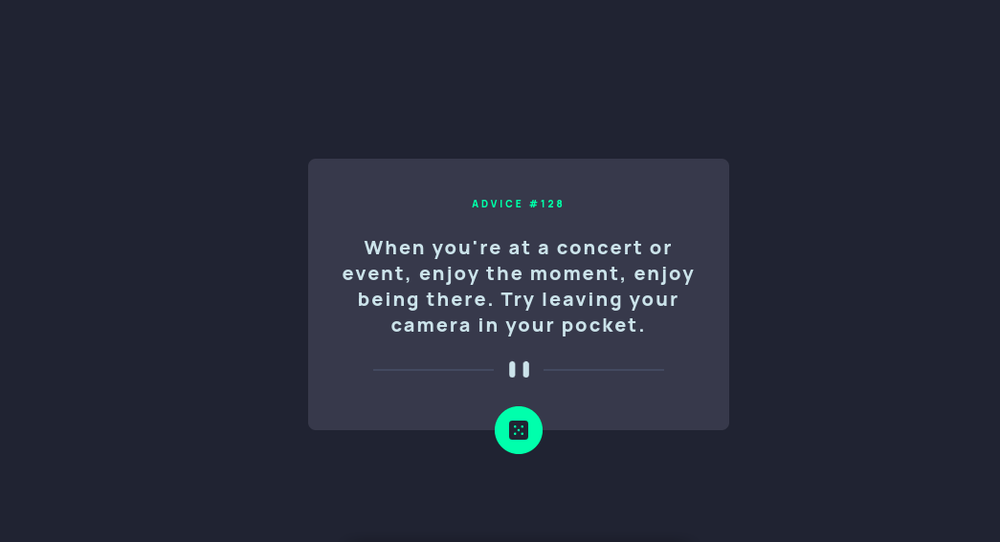

# Frontend Mentor - Advice generator app solution

This is a solution to the [Advice generator app challenge on Frontend Mentor](https://www.frontendmentor.io/challenges/advice-generator-app-QdUG-13db). Frontend Mentor challenges help you improve your coding skills by building realistic projects.

## Table of contents

- [Overview](#overview)
  - [The challenge](#the-challenge)
  - [Screenshot](#screenshot)
  - [Links](#links)
- [My process](#my-process)
  - [Built with](#built-with)
  - [What I learned](#what-i-learned)
  - [Continued development](#continued-development)
  - [Useful resources](#useful-resources)
- [Author](#author)
- [Acknowledgments](#acknowledgments)

## Overview

### The challenge

Users should be able to:

- View the optimal layout for the app depending on their device's screen size
- See hover states for all interactive elements on the page
- Generate a new piece of advice by clicking the dice icon

### Screenshot

### Links

- Solution URL: [Add solution URL here](https://your-solution-url.com)
- Live Site URL: [Add live site URL here](https://your-live-site-url.com)

## My process

### Built with

- Semantic HTML5 markup
- SASS custom properties
- TypeScript
- Axios
- [React](https://reactjs.org/) - JS library

### What I learned

In this challenge I improve my design skills with sass as well as using React with TypeScript,
so I could type the request made to the API easier.

To see how you can add code snippets, see below:

### Useful resources

## Author

- Website - [Miguel Madrigal](https://miguel-arturo-madrigal-escoto.github.io/portafolio/)
- Frontend Mentor - [@2KMiguel64](https://www.frontendmentor.io/profile/Miguel-Arturo-Madrigal-Escoto)
